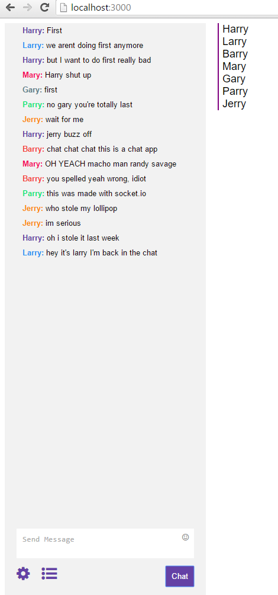

socket io chat app that resembles the twitch chat interface. displays usernames and each user gets to choose a color in which their name appears. 

nodejs, express, socket, react, babel, webpack  

help from Smitha Milli at http://smithamilli.com/

